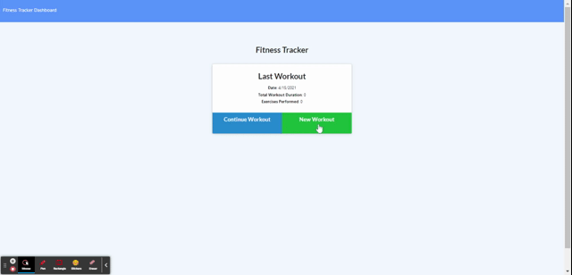

# workout-tracker

 
  * [Installation](#installation)
  * [Heroku](#Heroku)
  
  
  ------------------------------------
  
  ## Description
  
  Create and deploy full-stack workout tracker application. This assignment will require you to create Mongo database with a Mongoose schema and handle routes with Express.

  

  ### Technologies used for this project 
  * NoSQL
  * MongoDB
  * Object-document mapping
  * Mongoose.js
  * CRUD

 ### Additional resources

  [Mongoose Virtuals](https://mongoosejs.com/docs/tutorials/virtuals.html)

------------------------------------
  
  ## Installation
  
  To install this application, you will need to enter the following line of code into a Node.js session.  
      
      npm install
  
  
------------------------------------
  
  ## Heroku
  
  This application is deployed to Heroku.  To use the app, click the link below.

  https://jpn-workout-tracker.herokuapp.com/

    
      

  
  
  

